# tf_videogan

A TensorFlow version of [Generating Videos with Scene Dynamics](http://web.mit.edu/vondrick/tinyvideo/) (Keep updating...)

Since the original dataset is 9 TB, which is almost impossible for any individual to use it directly, I here extract the pre-trained model parameter from t7 format files. 

For now I have implemented the generator only, which can be used to generate videos. They claimed that the generated videos are not photo-realistic, maybe we can add additional loss functions to improve the model in the future.

## Demos

The following videos were generated from sampled noise:

<table><tr><td>
<strong>Beach</strong> 
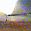
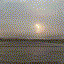
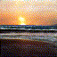
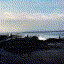 
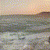
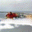

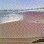 

</td><td>
<strong>Golf</strong> 
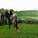
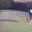
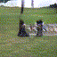
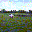 
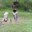
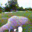
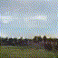
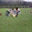 
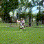
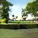
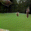
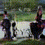
</td></tr><tr><td>
<strong>Train</strong> 
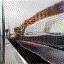
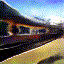

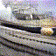 
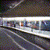
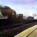
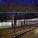
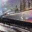 
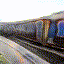
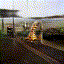
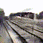
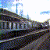
</td></tr></table>

## Models

You can find the 'beach' model in the repository. The remaining 2 models can be found [here](https://drive.google.com/drive/folders/0B2SnTpv8L4iLRzdWb2lQdjc2ZFE?usp=sharing)

And you can also extract other 2 models with the code `load_t7.py`. (You will need to install the package [torchfile](https://github.com/bshillingford/python-torchfile) first)

## Notes

You might want to see their original [torch implementation](https://github.com/cvondrick/videogan).
